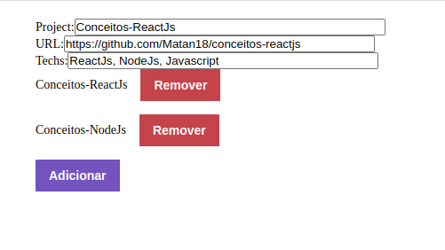

# conceitos-reactjs
## Desafio da semana 1 no GoStack da Rocketseat

Esse era o segundo desafio da semana, focado no ReactJS e integração com a API, nas aulas foi ensinado sobre os componentes, propriedades e estados do React, é muito interessante como esse framework/lib consegue incluir as tags HTML/XML no código, e fica bem mais fácil de entender o que vai ser mostrado em tela

## Techs

* ReactJS;
* Axios;

## Iniciar

Para iniciar o projeto, você deve:
* Estar rodando o Backend do projeto [Conceitos-NodeJs](https://github.com/Matan18/conceitos-nodejs);
* Fazer o clone do repositório e rodar `yarn` ou `npm install` para instalar as dependências;

## Descrição do desafio

O desafio é bastante simples, o programa deve ser capaz de enviar para o backend as informações e um projeto (Link, Nome e Techs), e remove-los através de um botão;

Foi utilizado o useEffect do React para carregar os projetos já cadastrados, e o useState para gravar as informações da lista de projetos.
Também foi utilizado a biblioteca Axios para fazer as requisições para o backend.

Aproveitei pra dar uma olhada no arquivo que faz testes, e achei mt legal que ele simula o backend, assim podemos testar a aplicação sem precisar deixar o backend rodando (lembrando que só funciona pra teste, se você precisar rodar o programa pra ver como o site está ficando, não vai dar o mesmo resultado)

Após enviar o desafio para a rocket fazer a análise, e validar que o desafio foi concluído com sucesso, eu adicionar os campos de inputs para poder escrever manualmente quais projetos eu queria adicionar na aplicação, são os inputs Projeto, URL e Techs;
